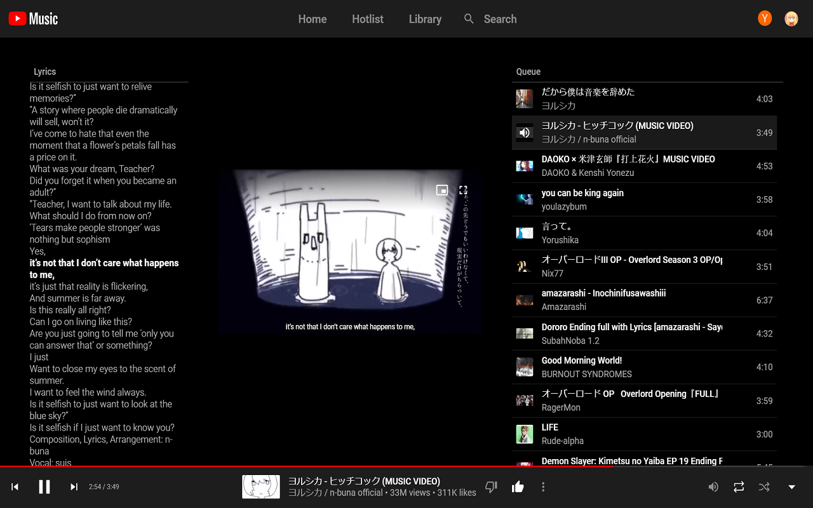
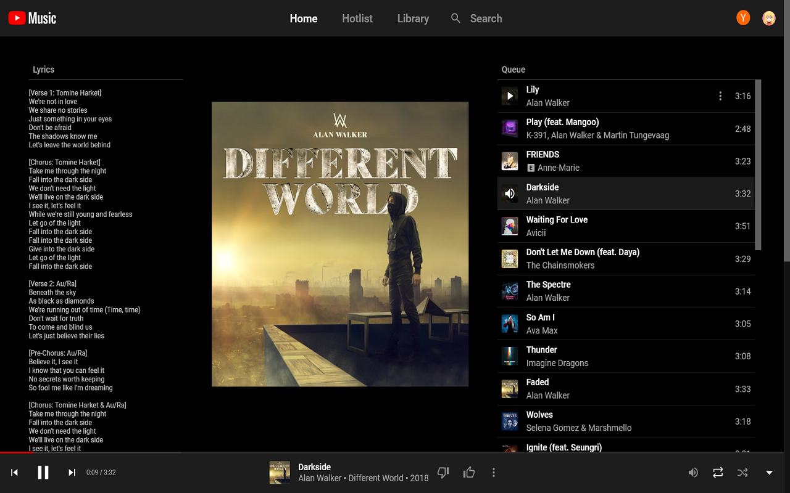

# YTSwag: Better YouTube Music (BETA)

This is a yet-under-construction project to add new features to Youtube Music! Beta version for testing available!

Oh, and accepting logo submissions. (Read: Begging for a good logo, I suck at design)

Also, accepting new feature ideas (create an issue) as long as they can be feasibly implemented (offline mode, for one, cannot be feasibly implemented, atleast with a Chrome Extension).

## Screenshots

## Installation

1. Download and Unzip or Clone the repo.
2. Click the Chrome menu icon and select Extensions from the Tools menu. Ensure that the "Developer mode" checkbox in the top right-hand corner is checked.
3. Click on Load Unpacked, select the YTSwag directory (where you cloned/downloaded the repo) and Select Folder.
4. Make sure it is enabled.

## How Lyrics Work (as of now)

1. The extension first tries to get the official Closed Caption of the video if available, and present it as lyrics. Cause the Closed Captions has a timer, it's possible to know when the lyrics start and end, and highlighting is done.
2. As a backup, lyrics from Genius is taken in case CC is not available. This is done in a way similar to [SwagLyrics](https://github.com/SwagLyrics/SwagLyrics-For-Spotify).
3. (Not implemented) Thinking of using something like https://audd.io but it costs money to implement T_T

## TODO list/Planned Features

- [ ] ~~Eliminate jQuery from code~~
- [ ] List available languages except english for CC Lyrics
- [ ] Make option to select lyrics engines
- [ ] Fix all the existing bugs
- [ ] Add a Discord Rich Presence activity like Spotify
- [ ] Better media button controls, especially on Linux (?)
- [ ] Better theme/theme engine (Planned for future, no plans on implementing as of now)

## Using

Given Genius will be accessed by you when the extension is used, you must comply by their [Terms of Use](https://genius.com/static/terms) if your use of YTSwag accesses their site.
They say that you should be authorized in writing by Genius except if it's content you legally uploaded there.
You should check out their official terms linked above to read the official document.

## Credits

1. [SwagLyrics](https://github.com/SwagLyrics/SwagLyrics-For-Spotify) for letting me ~~steal~~ get code on how to get lyrics from Genius.
